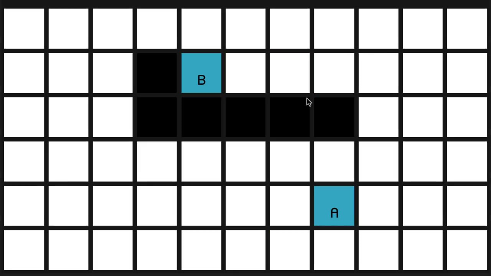
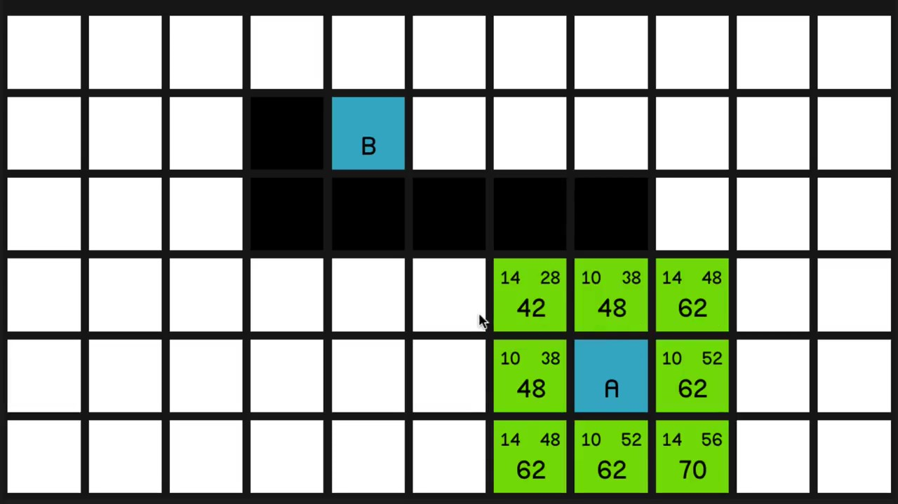
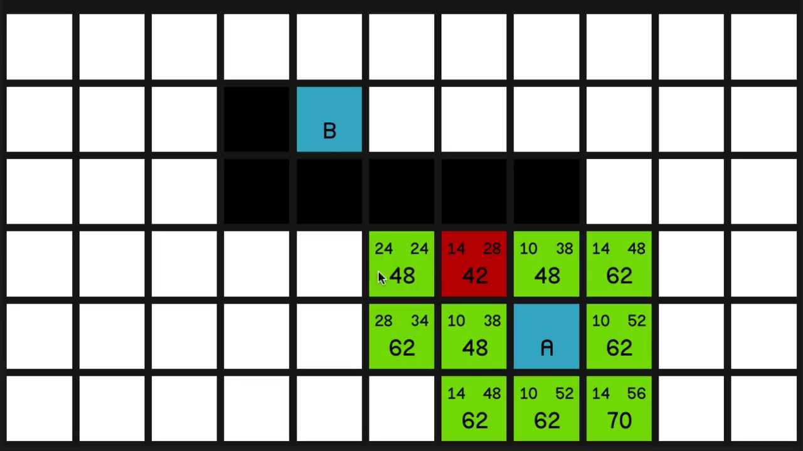
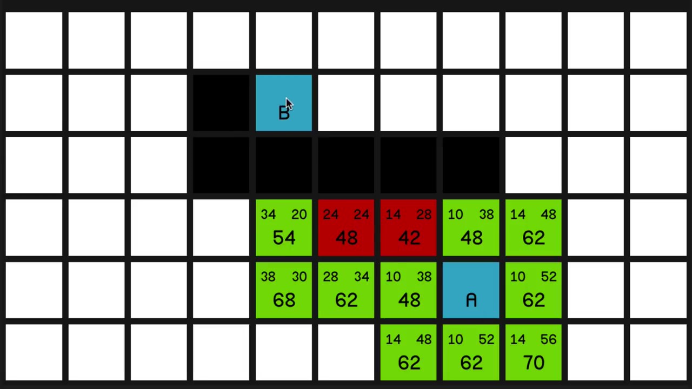
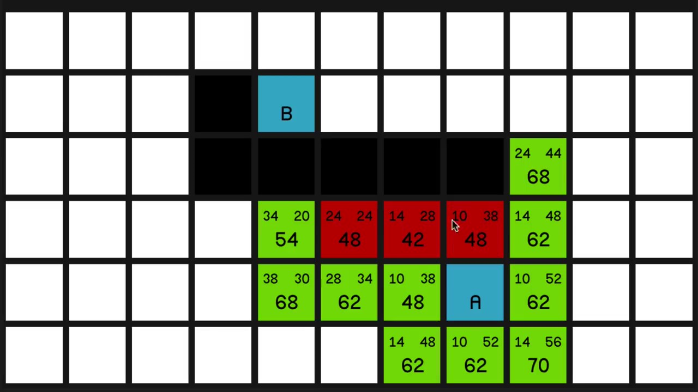
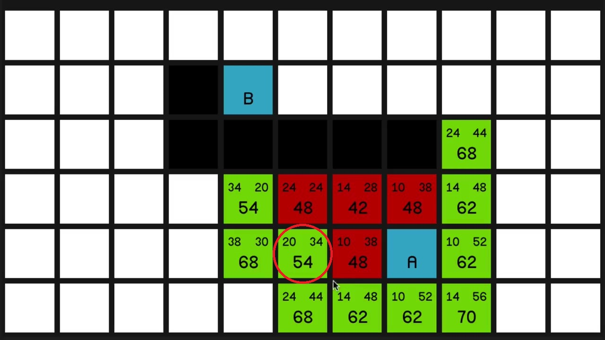
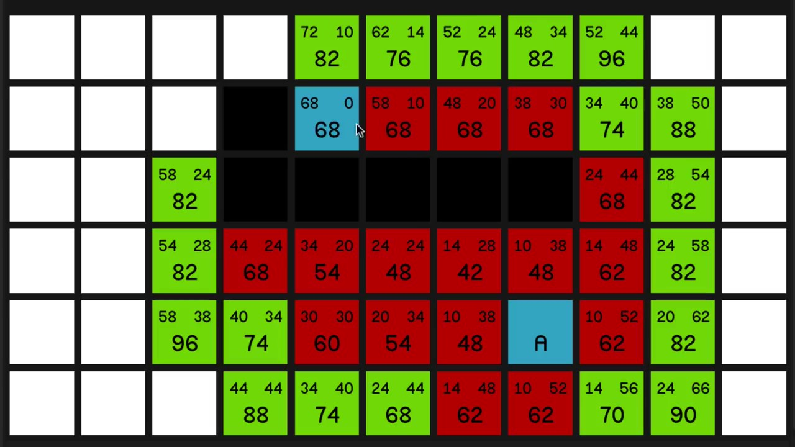
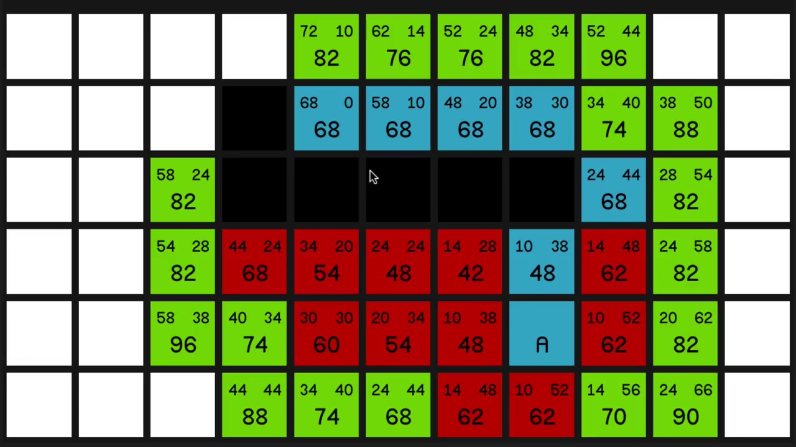

# A* 搜尋演算法

A*搜尋演算法是一種在圖形平面上**求出最短路徑**的演算法，常以節點作為路徑單位，並用於遊戲中NPC的移動計算上。

該演算法綜合了最良優先搜尋（英語：Best-first search）和Dijkstra演算法的優點：在進行啟發式搜尋提高演算法效率的同時，可以保證找到一條最佳路徑。

在此演算法中，如果以 **G cost** 表示從起點到任意節點的距離，以 **H cost** 表示從任意節點到終點的距離，那麼A*演算法的關鍵公式為：

```
F cost = G cost + H cost
```

該公式將會在每次搜尋<ins>路徑/新節點</ins>時被用到。

## 搜尋過程

這是一開始的地圖



* 方格等於節點
* A 為起點
* B 為終點
* 黑色是障礙物
* 白色是行走區域

如果要從 A 走最短路徑到 B，就必須先查看起點周圍的節點，計算出他們的 F/G/H cost。



* 方格的邊長是 10
* 斜邊的長度是 邊長 × $\sqrt {2}$ ≈ 14
* 左上角的數字是從起點（A）到該節點的距離（G cost）
* 右上角的數字是從該節點到終點（B）的距離（H cost）
* 最大的數字是兩距離的加總（F cost）

每次都會選擇 F cost 最低的節點前進，然後再計算其周圍的節點。



如果遇到 F cost 一樣的節點，就優先選擇 H cost 較低的。



如果連 H cost 都一樣，就隨機選擇一個。





注意看，這裡在選完後，有一個節點的數值變動了。其原因在於，每次選擇新節點時，其周圍的節點都會被重新計算。雖然 G cost 是指自己節點到起點的距離，但其距離是根據經過的節點來量測的。所以隨著節點數增多、與起點的路徑更加直接，cost 將會變得更小。

就這樣不斷重複著剛才的步驟，我們就能很快找到終點。





最後只要從其最終節點去反推，便能得到路徑。

## 虛擬碼

```c
OPEN //the set of nodes to be evaluated
CLOSED //the set of nodes already evaluated
add the start node to OPEN
 
loop
        current = node in OPEN with the lowest f_cost
        remove current from OPEN
        add current to CLOSED
 
        if current is the target node //path has been found
                return
 
        foreach neighbour of the current node
                if neighbour is not traversable or neighbour is in CLOSED
                        skip to the next neighbour
 
                if new path to neighbour is shorter OR neighbour is not in OPEN
                        set f_cost of neighbour
                        set parent of neighbour to current
                        if neighbour is not in OPEN
                                add neighbour to OPEN
```

## 程式實作

參考 YouTube 教學，使用 Unity 製作。


## 參考資料

https://zh.wikipedia.org/zh-tw/A*%E6%90%9C%E5%B0%8B%E6%BC%94%E7%AE%97%E6%B3%95  
https://www.youtube.com/playlist?list=PLFt_AvWsXl0cq5Umv3pMC9SPnKjfp9eGW
