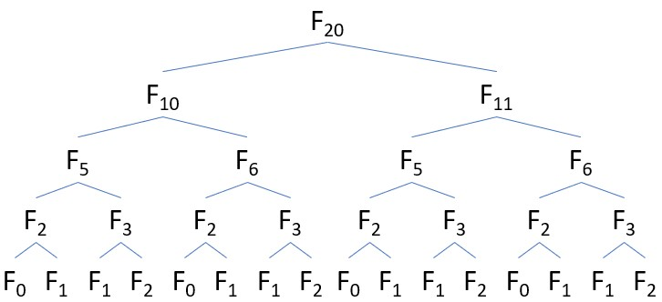

# Dynamic Programming

動態規劃，是一種透過把原問題分解為較簡單子問題的方式，來求解複雜問題的方法。

該方法只能在子問題具有重疊性，且可用來決定全域最佳解時使用。（例如：最小編輯距離、背包問題、費式數列）

該方法算是眾多演算法中偏難的一類，主要原因便在於如何進行套用。

本報告將以個人經驗搭配網路知識，寫出一套用來解動態規劃問題的詳細流程。

## 解題方式

動態規劃的解題方式，大致可分為兩種：

1. Bottom-Up（tabulation）
2. Top-Down（memoization）

這兩種在方法在本質上是一樣的，只是過程不一樣。

如果你使用表格法（tabulation）解決問題，那你是從底部開始解決。也就是首先解決所有相關的子問題（通常是填充一個 n 維表格），然後基於表格中的結果，計算出對應於"頂部"或原始問題的答案。

如果你使用備忘錄法（memoization）解決問題，則是通過維護一個已解決子問題的映射表來實現。這種方法是"由上而下"的，因為你首先解決"頂部"問題，然後再遞迴下去。

## 解題思路

上述的兩種方法各有他們的優缺點。一般來說，Buttom-Up 才是最傳統的動態規劃解法。但是 Top-Down 卻是更好懂、更直覺的。

原因就在於，大部分的動態規劃問題，都比較容易先想到遞迴解。而一旦想到遞迴解，再加個列表進行記錄就算是差不多了。

然而，並非所有問題都能這樣輕鬆解答。某些時候，雖然你能把它變成遞迴，卻不一定顯得這麼直觀。這在後續套用 DP 時，便容易出現 BUG。

因此，知道如何使用傳統的 Buttom-Up 也是相當重要的，就跟學 tree 要會用 DFS 跟 BFS 兩種一樣。

## 解題實戰

接下來我們將以 LeetCode 上經典的動態規劃問題（Climbing Stairs）當做範例，來看看實際的應用方式。以下是問題描述及其測資：

> You are climbing a staircase. It takes `n` steps to reach the top.  
> Each time you can either climb `1` or `2` steps. In how many distinct ways can you climb to the top?

> **Constraints:**  
> `1 <= n <= 45`

首先是最直覺的遞迴寫法：

```cpp
class Solution {
public:
    int climbStairs(int n) {
        if (n == 0)
        {
            return 1;
        }

        if (n < 0)
        {
            return 0;
        }

        return climbStairs(n - 1) + climbStairs(n - 2);
    }
};
```

仔細看的話會發現，這根本就是費氏數列。然而，單純的遞迴解雖然能得到答案，但是過程極慢，理由也跟費氏數列一樣，他重複的次數太多了：



也因此，我們必須採用動態規劃的方式，把已經跑過的結果記錄下來。首先是更為直覺的 Top-Down 寫法：

```cpp
class Solution {
public:
    int dp[46];

    int climbStairs(int n) {
        if (n == 0)
        {
            return 1;
        }

        if (n < 0)
        {
            return 0;
        }

        if (dp[n] > 0)
        {
            return dp[n];
        }

        dp[n] = climbStairs(n - 1) + climbStairs(n - 2);

        return dp[n];
    }
};
```

可以看到，這基本上就只是新增一個 `dp` 陣列，來把結果提前回傳。這裡會先遞迴到最深，然後在回傳前一一記錄子結果，確保在第二階段的遞迴（n-2）不用重算，而這樣也就足以通過 `n=45` 的極端測資了。而且還會是最快的。


接下來我們再來試試看 Bottom-Up 的解法。該解法在這裡的不直覺之處在於，我們一般解費氏數列都是採用遞迴解法。可是如果要用 Bottom-Up，我們就必須從小問題開始，用循環的方式慢慢累加上去。程式如下：

```cpp
class Solution {
public:
    int dp[46];

    int climbStairs(int n) {
        dp[0] = 1;
        dp[1] = 1;
        
        for (int i = 2; i <= n; i++)
        {
            dp[i] = dp[i-1] + dp[i-2];
        }

        return dp[n];
    }
};
```

可以看到，我們只是單純的把遞迴解改成循環解。雖然時間複雜度是一樣的，但扣除掉一些函式進出的成本後，理論上還是會稍微快一些（這裡 LeetCode 看不出來），而且也可以避免過度遞迴所造成的堆疊溢出問題。


綜上所述，我們已經熟知了基本的動態規劃操作。雖然這只是最簡單的範例，但只要往外沿用，一樣可以解決不少問題。

## 參考資料

https://www.youtube.com/watch?v=vYquumk4nWw  
https://stackoverflow.com/questions/6184869/what-is-the-difference-between-memoization-and-dynamic-programming  
https://leetcode.com/problems/climbing-stairs/description/
