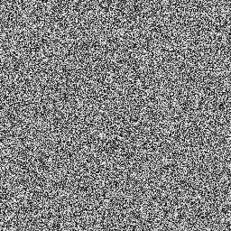
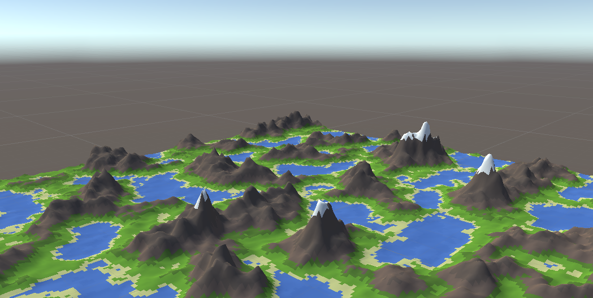

# Perlin 噪聲

Perlin噪聲（Perlin noise，又稱為柏林噪聲）指由Ken Perlin發明的自然噪聲生成算法，具有在函數上的連續性，並可在多次調用時給出一致的數值。在電子遊戲領域中可以透過使用Perlin噪聲生成具連續性的地形；或是在藝術領域中使用Perlin噪聲生成圖樣。生成噪聲最通常的想法是為每個像素賦予一個隨機的灰度值。如此產生的圖像如下圖:



用隨機法產生的噪聲圖像和顯然自然界物體的隨機噪聲有很大差別，不夠真實。1985年Ken Perlin指出，一個理想的噪聲應該具有以下性質：

1. 對旋轉具有統計不變性；
2. 能量在頻譜上集中於一個窄帶，即：圖像是連續的，高頻分量受限；
3. 對變換具有統計不變性。

對於計算機圖形學中的普遍應用，噪聲應該是偽隨機的，兩次調用應得到同樣的結果。 

## 程式實作

Perlin提出了一種產生符合要求的一維噪聲函數的簡單方法：

1. 在一維坐標軸上，選擇等距的無窮個點，將值空間劃分為等長的線段（為方便起見，選擇坐標值為整數的點），為每個點隨機指定一個值；
2. 對於坐標值為整數的點，將該點對應的值作為噪聲圖像上該點的值；對於坐標值不為整數的點，將相鄰兩點的值進行**插值**運算，獲得該點的數值(灰度)。
    * **插值**運算使用的函數是一個在0處為1，在1處為0，在0.5處為0.5的連續單調減函數。例如，設 ${c}_{0}$ , ${c}_{1}$ 為左右兩整數點的數值， $t$ 為該點距離左邊點的距離，使用 $(1-t)$ 作為插值函數，則該點的值為 ${c}_{1}(1-t)+{c}_{0}t$。

以下用python示例如何生成一維Perlin噪聲：

```py
from math import floor

#Perlin 最初提出的数组
SEQ = [
  151,160,137,91,90,15,
  131,13,201,95,96,53,194,233,7,225,140,36,103,30,69,142,8,99,37,240,21,10,23,
  190,6,148,247,120,234,75,0,26,197,62,94,252,219,203,117,35,11,32,57,177,33,
  88,237,149,56,87,174,20,125,136,171,168,68,175,74,165,71,134,139,48,27,166,
  77,146,158,231,83,111,229,122,60,211,133,230,220,105,92,41,55,46,245,40,244,
  102,143,54,65,25,63,161,1,216,80,73,209,76,132,187,208,89,18,169,200,196,
  135,130,116,188,159,86,164,100,109,198,173,186,3,64,52,217,226,250,124,123,
  5,202,38,147,118,126,255,82,85,212,207,206,59,227,47,16,58,17,182,189,28,42,
  223,183,170,213,119,248,152,2,44,154,163,70,221,153,101,155,167,43,172,9,
  129,22,39,253,19,98,108,110,79,113,224,232,178,185,112,104,218,246,97,228,
  251,34,242,193,238,210,144,12,191,179,162,241,81,51,145,235,249,14,239,107,
  49,192,214,31,181,199,106,157,184,84,204,176,115,121,50,45,127,4,150,254,
  138,236,205,93,222,114,67,29,24,72,243,141,128,195,78,66,215,61,156,180]

#插值函数
def _blending(t):
    return t*(t*(t*(10+t*(-15+6*t))))              #6t^5 -15t^4 + 10t^3

def noise(pos):
    if pos%1 == 0:                                 #对于整数点，直接从数列中取得数值即可。
        return SEQ[int(pos%255)]
    else:                                          #对于非整数的点，由左右的整数进行插值运算得出数值。
        x0,x1 = floor(pos)%255,floor(pos+1)%255    #取得非整数点旁的两个整数。
        c0,c1 = SEQ[x0],SEQ[x1]                    #从数列中取得两个整数点的数值。
        t = pos%255 - x0                           #计算非整数点离左边整数点的距离。
        return (c0*_blending(1-t)+c1*_blending(t)) #使用插值函数计算非整数点的数值并输出。
```

對於二維情況，可以將上述算法進行推廣，即：

1. 為所有坐標為 $(x,\,y)$ 且 $x,\,y$ 都是整數的點指定一個值，同時指定一個**梯度**，這些點將空間分成方格。
    * 在指定**梯度**時，理論上應該任意生成一個長度為1的向量。在二維的情況下，梯度可以從 $(1,2)$ , $(2,1)$ , $(−1,2)$ , $(−2,1)$ , $(−1,−2)$ , $(−2,−1)$ , $(1,−2)$ , $(2,−1)$ 這8個向量之中隨機選擇一個。這8個向量具有相同的長度，因此點積後的歸一化計算可以省略。
2. 對於坐標軸為整數的點，即上述方格的頂點，將為它指定的值作為該點的值；對於某個方格內部的點 $(x,\,y)$，用所在方格四個頂點的值和梯度進行**插值**。
    * 在二維的情況下，**插值**更為複雜。例如，對於點 $(x,y)$，令 $i = ⌊ x ⌋$ , $j = ⌊ y ⌋$ 它所在方格的四個頂點分別為： $(i,j)$、$(i+1,j)$、$(i+1,j+1)$、$(i,j+1)$。首先需要對 $(i,j)$ 和 $(i+1,j)$ 兩點在 $x$ 方向插值，得到點 $(x,j)$ 的值；之後對 $(i,j+1)$ 和 $(i+1,j+1)$ 兩點在 $x$ 方向插值，得到點 $(x,j+1)$ 的值；最後對 $(x,j)$ 和 $(x,j+1)$ 在 $y$ 方向插值，得到 $(x,y)$ 的值。

以下用python示例如何生成二維Perlin噪聲：

```py
import numpy as np
import matplotlib.pyplot as plt

def perlin(x, y, seed=0):
    # permutation table
    np.random.seed(seed)
    p = np.arange(256, dtype=int)
    np.random.shuffle(p)
    p = np.stack([p, p]).flatten()
    # coordinates of the top-left
    xi, yi = x.astype(int), y.astype(int)
    # internal coordinates
    xf, yf = x - xi, y - yi
    # fade factors
    u, v = fade(xf), fade(yf)
    # noise components
    n00 = gradient(p[p[xi] + yi], xf, yf)
    n01 = gradient(p[p[xi] + yi + 1], xf, yf - 1)
    n11 = gradient(p[p[xi + 1] + yi + 1], xf - 1, yf - 1)
    n10 = gradient(p[p[xi + 1] + yi], xf - 1, yf)
    # combine noises
    x1 = lerp(n00, n10, u)
    x2 = lerp(n01, n11, u)  # FIX1: I was using n10 instead of n01
    return lerp(x1, x2, v)  # FIX2: I also had to reverse x1 and x2 here

def lerp(a, b, x):
    "linear interpolation"
    return a + x * (b - a)

def fade(t):
    "6t^5 - 15t^4 + 10t^3"
    return 6 * t**5 - 15 * t**4 + 10 * t**3

def gradient(h, x, y):
    "grad converts h to the right gradient vector and return the dot product with (x,y)"
    vectors = np.array([[0, 1], [0, -1], [1, 0], [-1, 0]])
    g = vectors[h % 4]
    return g[:, :, 0] * x + g[:, :, 1] * y

# EDIT : generating noise at multiple frequencies and adding them up
p = np.zeros((100,100))
for i in range(4):
    freq = 2**i
    lin = np.linspace(0, freq, 100, endpoint=False)
    x, y = np.meshgrid(lin, lin)  # FIX3: I thought I had to invert x and y here but it was a mistake
    p = perlin(x, y, seed=87) / freq + p

plt.imshow(p, origin='upper')
plt.show()
```
## 相關應用

Perlin噪聲可以用來模擬自然界中的噪聲現象。由於它的連續性，如果將二維噪聲中的一個軸作為時間軸，得到的就是一個連續變化的一維函數。同樣的也可以得到連續變化的二維圖像。該噪聲可以用來模擬人體的隨機運動，螞蟻行進的線路等。另外，還可以通過計算分形和模擬雲朵，火焰等非常複雜的紋理。

以下是我透過Unity內建的Perlin噪聲，參考YouTube上的教學所生成的隨機地形。



Perlin噪聲對各個點的計算是相互獨立的，因此非常適合使用圖形處理器進行計算。OpenGL在GLSL中定義了一維至四維的噪聲函數noise1、noise2、noise3、noise4，在該規範中噪聲的性質與上述Perlin提出的性質相同。在Mesa 3D實現中，這一組函數是使用Simplex算法實現的。在硬體的實現中，噪聲的生成可以達到實時效果。

## 參考資料

https://zh.wikipedia.org/wiki/Perlin%E5%99%AA%E5%A3%B0  
https://stackoverflow.com/questions/42147776/producing-2d-perlin-noise-with-numpy  
https://www.youtube.com/playlist?list=PLFt_AvWsXl0eBW2EiBtl_sxmDtSgZBxB3
